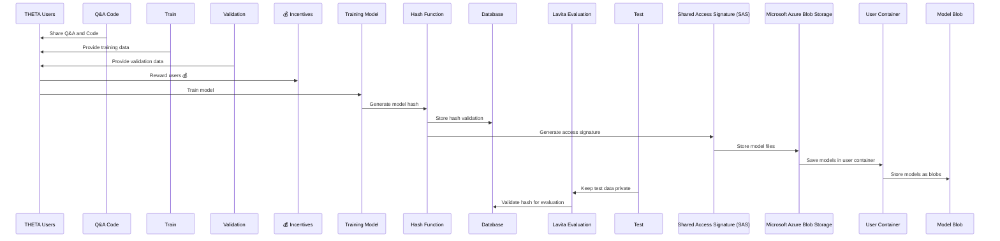

```mermaid
sequenceDiagram
    participant User as THETA Users
    participant QACode as Q&A Code
    participant Train as Train
    participant Validation as Validation
    participant Incentives as 💰 Incentives
    participant Model as Training Model
    participant HashFunc as Hash Function
    participant DB as Database
    participant Eval as Lavita Evaluation
    participant Test as Test
    participant SAS as Shared Access Signature (SAS)
    participant Azure as Microsoft Azure Blob Storage
    participant Container as User Container
    participant Blob as Model Blob

    QACode ->> User: Share Q&A and Code
    Train ->> User: Provide training data
    Validation ->> User: Provide validation data
    User ->> Incentives: Reward users 💰
    User ->> Model: Train model
    Model ->> HashFunc: Generate model hash
    HashFunc ->> DB: Store hash validation
    HashFunc ->> SAS: Generate access signature
    SAS ->> Azure: Store model files
    Azure ->> Container: Save models in user container
    Container ->> Blob: Store models as blobs
    Test ->> Eval: Keep test data private
    Eval ->> DB: Validate hash for evaluation
```