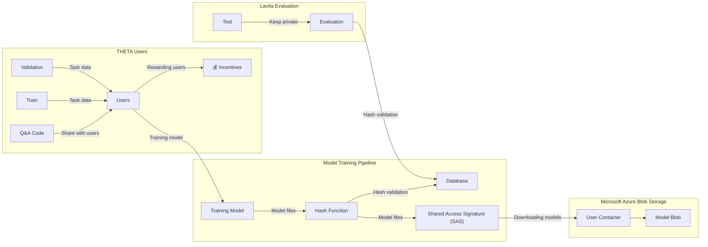

```mermaid
flowchart LR
    subgraph THETA_Users["THETA Users"]
        direction TB
        QA_Code["Q&A Code"] -->|Share with users| Users
        Train["Train"] & Validation["Validation"] -->|Task data| Users
        Users -->|Rewarding users| Incentives["💰 Incentives"]
    end

    subgraph Model_Training["Model Training Pipeline"]
        direction TB
        Users -->|Training model| Training_Model["Training Model"]
        Training_Model -->|Model files| Hash_Function["Hash Function"]
        Hash_Function -->|Hash validation| Database["Database"]
        Hash_Function -->|Model files| SAS["Shared Access Signature (SAS)"]
    end

    subgraph Lavita_Evaluation["Lavita Evaluation"]
        direction TB
        Test["Test"] -->|Keep private| Evaluation["Evaluation"]
        Evaluation -->|Hash validation| Database
    end

    subgraph Azure_Storage["Microsoft Azure Blob Storage"]
        direction TB
        SAS -->|Downloading models| User_Container["User Container"]
        User_Container --> Model_Blob["Model Blob"]
    end
```
